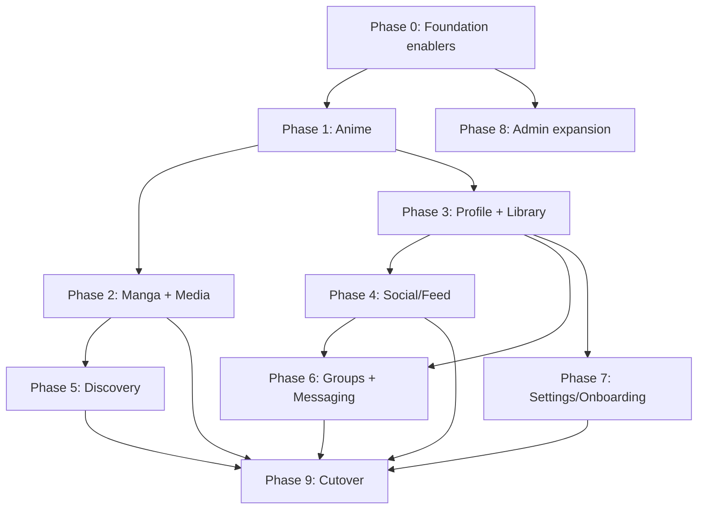

# Kitsu V3 → V4 Migration Plan & Roadmap

> Status: living document. V4 = this React/Vite app (the `react` branch). V3 = the legacy
> Ember client (prior generation of the Kitsu web client). This plan describes how we
> incrementally replace V3 with V4 while both run in production.

---

## 1. Goal & Strategy

**Goal:** Fully replace the Ember V3 client with the React V4 client, route-by-route, with no
"big bang" rewrite and no regressions in SEO, auth, or core user workflows.

**Strategy: Strangler-fig.** Stand up V4 routes alongside V3, then flip traffic per route at the
edge as each reaches feature parity. Two integration modes already exist in the build:

| Mode | Entry point | Build target | Use |
| --- | --- | --- | --- |
| Standalone SPA | `src/entry-client.tsx` | `client` | V4 owns the whole route |
| Embedded components | `src/entry-ember.tsx` (`mount`/`unmount`) | `library` | Drop V4 React components into a V3 Ember page |
| Qu embed | `src/entry-qu-embed.tsx` | `client` | Standalone embeddable widget |

**Guiding principles**

- **Vertical slices.** Migrate an entire domain (e.g. Anime) end-to-end before moving on, so V3
  code can actually be retired and we avoid long-lived dual maintenance.
- **Flip at the edge.** A routing table (CDN/edge — the repo ships `public/_headers`) decides
  which path prefixes resolve to V4 vs V3. Parity reached → flip the prefix.
- **Shared session.** V3 and V4 must share the same auth token so users stay logged in when they
  cross the boundary. The contract lives in `SessionContext` + `@nanoauth`.
- **Definition of Done (per route)** — see the checklist in §6.

---

## 2. Current State Assessment (2026-06)

### 2.1 Infrastructure — mature ✅

- **Build:** Vite 8, two targets via `BUILD_TARGET` (`client` / `library`).
- **Data:** urql + Graphcache (normalized cache), `gql.tada` typed GraphQL, custom scalars,
  cache resolvers (`src/graphql/resolvers.ts`), optimistic mutations (currently `MediaReaction`),
  auth + cache urql exchanges.
- **Auth / session:** `@nanoauth/*`, `SessionContext`, `AccountContext`, `oauth2-callback.html`.
- **i18n:** `react-intl` + Crowdin sync, `codegen:intl` extraction. Literal-string ESLint gate.
- **Theming / styling:** `theme-init`, `LayoutSettingsContext`, design tokens in
  `src/styles/globals`, PostCSS pipeline, logical-property enforcement.
- **Routing:** react-router v6, typed path builders (`Path` / `pathTree` in `src/utils/routes`),
  modal-over-background pattern in `src/Router.tsx`.
- **Quality tooling:** Storybook 8, Vitest + RTL, Cypress, ESLint/Prettier/Stylelint, Sentry.

### 2.2 Component library — started 🟡

- **content:** `Avatar`, `BannerImage`, `Byline`, `CategoryList`, `CategoryTag`, `Description`,
  `Image`, `PosterImage`, `Reaction`, `Tag`, `Link`
- **controls:** `Button`, `Checkbox`, `Field`, `TextInput`
- **surfaces:** `Card` · **navigation:** `TabBar`
- **shell / misc:** `Header`, `Layout`, `Modal`, `Dropdown`, `GroupBox`, `Section`, `Rule`,
  `Toaster`, `Formatted`, `ModalLink`, `AuthModalHeader`
- **Notable gaps:** richer form controls (select, radio, textarea, file/image upload), media
  cards & grids, pagination / infinite scroll, comment & post composer, rating widget, menus,
  tooltips, skeleton loaders, empty/error states, data tables.

### 2.3 Pages — early 🔴 (only 3 surfaces migrated)

| Status | Route | Notes |
| --- | --- | --- |
| ✅ | `/anime/:slug` | Summary tab only |
| ✅ | `/auth/sign-in`, `/auth/sign-up`, `/auth/forgot-password` | page + modal display modes |
| ✅ | `/admin/held` | moderation: held content |
| 🚧 | `/anime/:slug/{episodes,episodes/:n,characters,staff,reactions,franchise,quotes,quotes/:id}` | path builders exist, **pages not built** |
| 🚧 | `/users/:slug/{reactions,reviews,followers,following,groups,library/:type}` | path builders exist, **pages not built** |
| 🚧 | `/posts/:id`, `/comments/:id` | path builders exist, **pages not built** |
| ❌ | Manga, Library dashboard, Browse/Explore, Search, Feed, Groups, Settings, Notifications, Messaging, Homepage, Onboarding | not started |

Root `/` and any unmatched path render `NotFound` by design (`*` route in `src/Router.tsx`).

### 2.4 Resolved Phase 0 tech debt ✅

- **React 19 entry points — resolved:** `entry-client`, `entry-ember`, and `entry-qu-embed` now use
  `createRoot` / `root.unmount()`. The `library` target builds cleanly.
- **SSR scaffold — resolved by choosing CSR-first:** the naive `entry-server` target was removed,
  along with `build:server` and the misleading SSR placeholders. The app is explicitly CSR-first
  because core contexts are browser-coupled (`window`/cookies, browser storage, async locale data)
  and urql is created client-side, making production SSR unjustified for now. Revisit SSR only if
  SEO needs require it, with SSR-safe contexts, `ssrExchange`, `hydrateRoot`, and a server harness.
- **Stale Ember bridge — resolved:** `src/pages/ember.ts` is now a minimal empty stub
  (`export {};`). `entry-ember.tsx` still exports `Pages` from it, so the namespace is empty until
  real embeddable pages are added.
- **Type-check gate — nearly complete:** `pnpm typecheck` exists and passes; CI is being wired to
  run typecheck, ESLint, and client/library builds on every push and PR.

---

## 3. Roadmap

Phases are roughly sequential, but Phase 0 enablers unblock everything and several verticals can
run in parallel once the pattern is proven.

### Phase 0 — Stabilize the foundation (enablers)
- ✅ React 19 entry points migrated: `entry-ember` + `entry-qu-embed` now use `createRoot` /
  root API.
- ✅ Stale `pages/modals/ember` export repaired with a minimal `src/pages/ember.ts` stub; the
  `library` target builds.
- ✅ Explicit CSR-first decision made: production SSR is deferred until SEO needs justify making
  contexts SSR-safe and adding `ssrExchange`, `hydrateRoot`, and a server harness.
- ✅ `typecheck` script added (`tsc --noEmit`) and CI is being gated on typecheck, ESLint, and
  client/library builds.
- Formalize **edge routing table** (path prefixes → V4 vs V3) and the **shared-auth contract**.
- Standardize Suspense + error boundaries, skeleton/loading and empty/error states; decide `/`
  behavior (redirect vs landing).
- CI: unit coverage baseline + Cypress E2E smoke across the boundary.

### Phase 1 — Anime vertical (proves the pattern)
- Build remaining Anime tabs: Episodes, Episode detail, Characters, Staff, Reactions, Franchise,
  Quotes, Quote detail.
- Library actions on media (status / progress / rating) wired end-to-end via `LibraryBox` +
  optimistic mutations; reaction composer + voting.
- Flip `/anime/*` to V4 at the edge; retire V3 anime routes.

### Phase 2 — Manga + Media generalization
- Generalize the `Media` abstraction so Anime and Manga share `Layout` / `Banner` / `LibraryBox`.
- Manga routes mirroring Anime (chapters/volumes instead of episodes).

### Phase 3 — User / Profile vertical
- Profile summary; **Library dashboard** (filter/sort/status columns, progress, bulk edit — core
  retention surface); Reactions; Reviews; Followers / Following; Groups tab.
- Follow/unfollow, library import & management.

### Phase 4 — Social / Feed vertical
- Global + user feeds, Post detail, Comment threads + composer, likes/reactions, media embeds.
- Notifications.

### Phase 5 — Discovery
- Homepage / dashboard, Browse / Explore, Search (typeahead + results), genre/category browse,
  seasonal & trending.

### Phase 6 — Groups & Messaging
- Groups: directory, group page, members, group feed, group moderation.
- Direct messaging / PMs.

### Phase 7 — Settings, Account & Onboarding
- Account / profile / notification / privacy settings, linked accounts, importers (MAL/AniList),
  onboarding flow.

### Phase 8 — Admin / Moderation expansion
- Beyond held content: reports queue, user moderation, content-management dashboards.

### Phase 9 — Cutover & retirement
- Flip remaining traffic to V4; retire the Ember app and the `library`/`entry-ember` bridge;
  remove dual-auth shims; final SSR/perf/a11y/SEO hardening.

---

## 4. Dependency / sequencing rationale

**Why this order:** Anime is the highest-traffic, most SEO-valuable surface and already has the
most scaffolding — it proves the end-to-end pattern. Manga reuses the Media abstraction. Profile/
Library is the core retention surface and unblocks Social. Discovery and Groups build on the
prior data layers. Settings and Admin are lower-traffic and can slot in opportunistically.

---

## 5. Cross-cutting workstreams (run continuously)

- **Design system:** grow the component library + Storybook coverage ahead of page work.
- **GraphQL/data:** queries, mutations, Graphcache normalization, optimistic updates, resolvers,
  schema codegen discipline (`pnpm codegen`).
- **i18n:** every string via `react-intl`; `pnpm codegen:intl` after new keys; Crowdin sync.
- **Accessibility:** Storybook a11y addon, keyboard/screen-reader passes per route.
- **Performance/SEO:** route-level code splitting, image pipeline (blurhash/sharp), Core Web
  Vitals; revisit SSR for public routes only if SEO needs justify it.
- **Testing:** Vitest unit + RTL per component/page; Cypress E2E for critical journeys,
  including V3↔V4 boundary crossings.
- **Observability:** Sentry error tracking; track migration KPIs (see §7).

---

## 6. Per-route Definition of Done

- [ ] Feature parity with the V3 route (enumerate behaviors first)
- [ ] Routes + typed path builders (`src/utils/routes`)
- [ ] Data layer: queries/mutations, Graphcache keys/resolvers, optimistic updates
- [ ] Reusable components have Storybook stories
- [ ] All strings internationalized; `codegen:intl` run
- [ ] Loading (Suspense/skeleton), empty, and error states
- [ ] Accessibility pass (a11y addon clean, keyboard + SR)
- [ ] Unit tests (Vitest + RTL) + E2E happy path (Cypress)
- [ ] SSR-compatible or explicitly CSR-only with rationale
- [ ] Analytics + Sentry wired
- [ ] Edge route flipped V3 → V4; corresponding V3 code retired

---

## 7. Risks & mitigations

| Risk | Impact | Mitigation |
| --- | --- | --- |
| Long-lived dual maintenance | High | Vertical slices; flip & retire routes aggressively |
| Auth/session drift across V3↔V4 | High | Shared token contract; cross-boundary E2E tests |
| SSR/SEO regressions on public pages | High | CSR-first for now; defer SSR until SEO needs justify SSR-safe contexts and a server harness |
| Graphcache correctness (normalization, optimistic) | Med | Invest in resolvers + cache tests |
| React 19 removed APIs | Med | Done: all entry points use the React 18+ root API |
| Per-route scope creep | Med | Enforce the §6 DoD; parity list before building |
| GraphQL schema drift | Low | `pnpm codegen` discipline; schema in CI |

---

## 8. KPIs to track

- % of routes served by V4 · % of production traffic on V4
- Parity completeness per domain (Anime, Manga, Profile, …)
- Core Web Vitals / Lighthouse for migrated public routes
- Error rate (Sentry) per migrated route vs V3 baseline
- Test coverage trend; number of V3 modules retired
